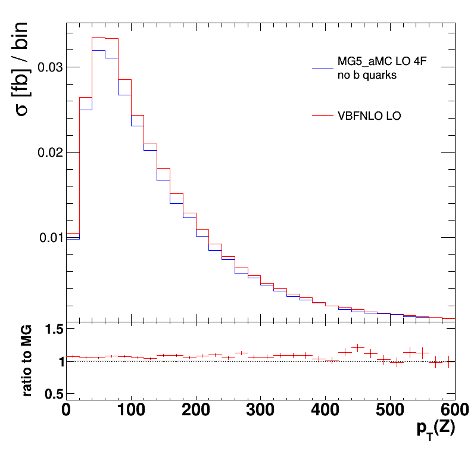

<html>
<head>
  <title>VBS comparisons: EWK p p > e+ v mu+ mu-</title>
  
</head>
<body>
  
<b>VBS comparisons: EWK p p > e+ v mu+ mu-</b>

  <table>
  
Plots by channel: 
  <a href="eee">[eee]</a> -   <a href="eem">[eem]</a> -   <a href="emm">[emm]</a> -   <a href="mmm">[mmm]</a>

  <table>
  <tr style="text-align: center;">
    <td style="text-align: center;">
         
        <a href="logs/hmqq_event_info.log">[log]</a> - 
        <a href="logs/hmqq_event_info-verbose.log">[verbose log]</a> - 
        <a href="plots/hmqq.pdf">[pdf]</a>
    </td>
    <td style="text-align: center;">
         
        <a href="logs/heta_event_info.log">[log]</a> - 
        <a href="logs/heta_event_info-verbose.log">[verbose log]</a> - 
        <a href="plots/heta.pdf">[pdf]</a>
    </td>
    <td style="text-align: center;">
         
        <a href="logs/hdeta_event_info.log">[log]</a> - 
        <a href="logs/hdeta_event_info-verbose.log">[verbose log]</a> - 
        <a href="plots/hdeta.pdf">[pdf]</a>
    </td>
  </tr>
  <tr style="text-align: center;">
    <td style="text-align: center;">
         
        <a href="logs/hpt_event_info.log">[log]</a> - 
        <a href="logs/hpt_event_info-verbose.log">[verbose log]</a> - 
        <a href="plots/hpt.pdf">[pdf]</a>
    </td>
    <td style="text-align: center;">
         
        <a href="logs/hptq1_event_info.log">[log]</a> - 
        <a href="logs/hptq1_event_info-verbose.log">[verbose log]</a> - 
        <a href="plots/hptq1.pdf">[pdf]</a>
    </td>
    <td style="text-align: center;">
         
        <a href="logs/hptq2_event_info.log">[log]</a> - 
        <a href="logs/hptq2_event_info-verbose.log">[verbose log]</a> - 
        <a href="plots/hptq2.pdf">[pdf]</a>
    </td>
  </tr>
  <tr style="text-align: center;">
    <td style="text-align: center;">
         
        <a href="logs/hetaq1_event_info.log">[log]</a> - 
        <a href="logs/hetaq1_event_info-verbose.log">[verbose log]</a> - 
        <a href="plots/hetaq1.pdf">[pdf]</a>
    </td>
    <td style="text-align: center;">
         
        <a href="logs/hetaq2_event_info.log">[log]</a> - 
        <a href="logs/hetaq2_event_info-verbose.log">[verbose log]</a> - 
        <a href="plots/hetaq2.pdf">[pdf]</a>
    </td>
    <td style="text-align: center;">
         
        <a href="logs/hptlw_event_info.log">[log]</a> - 
        <a href="logs/hptlw_event_info-verbose.log">[verbose log]</a> - 
        <a href="plots/hptlw.pdf">[pdf]</a>
    </td>
  </tr>
  <tr style="text-align: center;">
    <td style="text-align: center;">
         
        <a href="logs/hptnw_event_info.log">[log]</a> - 
        <a href="logs/hptnw_event_info-verbose.log">[verbose log]</a> - 
        <a href="plots/hptnw.pdf">[pdf]</a>
    </td>
    <td style="text-align: center;">
         
        <a href="logs/hptzp_event_info.log">[log]</a> - 
        <a href="logs/hptzp_event_info-verbose.log">[verbose log]</a> - 
        <a href="plots/hptzp.pdf">[pdf]</a>
    </td>
    <td style="text-align: center;">
         
        <a href="logs/hptzm_event_info.log">[log]</a> - 
        <a href="logs/hptzm_event_info-verbose.log">[verbose log]</a> - 
        <a href="plots/hptzm.pdf">[pdf]</a>
    </td>
  </tr>
  <tr style="text-align: center;">
    <td style="text-align: center;">
         
        <a href="logs/hetalw_event_info.log">[log]</a> - 
        <a href="logs/hetalw_event_info-verbose.log">[verbose log]</a> - 
        <a href="plots/hetalw.pdf">[pdf]</a>
    </td>
    <td style="text-align: center;">
         
        <a href="logs/hetanw_event_info.log">[log]</a> - 
        <a href="logs/hetanw_event_info-verbose.log">[verbose log]</a> - 
        <a href="plots/hetanw.pdf">[pdf]</a>
    </td>
    <td style="text-align: center;">
         
        <a href="logs/hetazp_event_info.log">[log]</a> - 
        <a href="logs/hetazp_event_info-verbose.log">[verbose log]</a> - 
        <a href="plots/hetazp.pdf">[pdf]</a>
    </td>
  </tr>
  <tr style="text-align: center;">
    <td style="text-align: center;">
         
        <a href="logs/hetazm_event_info.log">[log]</a> - 
        <a href="logs/hetazm_event_info-verbose.log">[verbose log]</a> - 
        <a href="plots/hetazm.pdf">[pdf]</a>
    </td>
    <td style="text-align: center;">
         
        <a href="logs/hmz_event_info.log">[log]</a> - 
        <a href="logs/hmz_event_info-verbose.log">[verbose log]</a> - 
        <a href="plots/hmz.pdf">[pdf]</a>
    </td>
    <td style="text-align: center;">
         
        <a href="logs/hyz_event_info.log">[log]</a> - 
        <a href="logs/hyz_event_info-verbose.log">[verbose log]</a> - 
        <a href="plots/hyz.pdf">[pdf]</a>
    </td>
  </tr>
  <tr style="text-align: center;">
    <td style="text-align: center;">
         
        <a href="logs/hptz_event_info.log">[log]</a> - 
        <a href="logs/hptz_event_info-verbose.log">[verbose log]</a> - 
        <a href="plots/hptz.pdf">[pdf]</a>
    </td>
    <td style="text-align: center;">
         
        <a href="logs/hmw_event_info.log">[log]</a> - 
        <a href="logs/hmw_event_info-verbose.log">[verbose log]</a> - 
        <a href="plots/hmw.pdf">[pdf]</a>
    </td>
    <td style="text-align: center;">
         
        <a href="logs/hmwz_event_info.log">[log]</a> - 
        <a href="logs/hmwz_event_info-verbose.log">[verbose log]</a> - 
        <a href="plots/hmwz.pdf">[pdf]</a>
    </td>
  </tr>
  <tr style="text-align: center;">
    <td style="text-align: center;">
         
        <a href="logs/hyw_event_info.log">[log]</a> - 
        <a href="logs/hyw_event_info-verbose.log">[verbose log]</a> - 
        <a href="plots/hyw.pdf">[pdf]</a>
    </td>
    <td style="text-align: center;">
         
        <a href="logs/hptw_event_info.log">[log]</a> - 
        <a href="logs/hptw_event_info-verbose.log">[verbose log]</a> - 
        <a href="plots/hptw.pdf">[pdf]</a>
    </td>
    <td style="text-align: center;">
         
        <a href="logs/hmwq1_event_info.log">[log]</a> - 
        <a href="logs/hmwq1_event_info-verbose.log">[verbose log]</a> - 
        <a href="plots/hmwq1.pdf">[pdf]</a>
    </td>
  </tr>
  <tr style="text-align: center;">
    <td style="text-align: center;">
         
        <a href="logs/hmwq2_event_info.log">[log]</a> - 
        <a href="logs/hmwq2_event_info-verbose.log">[verbose log]</a> - 
        <a href="plots/hmwq2.pdf">[pdf]</a>
    </td>
</body>
</html>