<html>
<body>
  
<b>WZGenAnalysis/rivetParticles</b>

  <table>
  
Plots by channel: 
  <a href="../eee">[eee]</a> -   <a href="../eem">[eem]</a> -   <a href="../emm">[emm]</a> -   <a href="../mmm">[mmm]</a>

  <table>
  <tr style="text-align: center;">
    <td style="text-align: center;">
        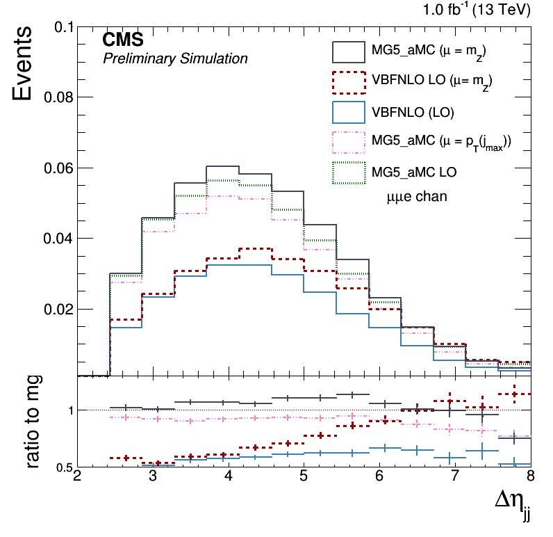 
        <a href="logs/dEtajj_event_info.log">[log]</a> - 
        <a href="logs/dEtajj_event_info-verbose.log">[verbose log]</a> - 
        <a href="plots/dEtajj.pdf">[pdf]</a>
    </td>
    <td style="text-align: center;">
        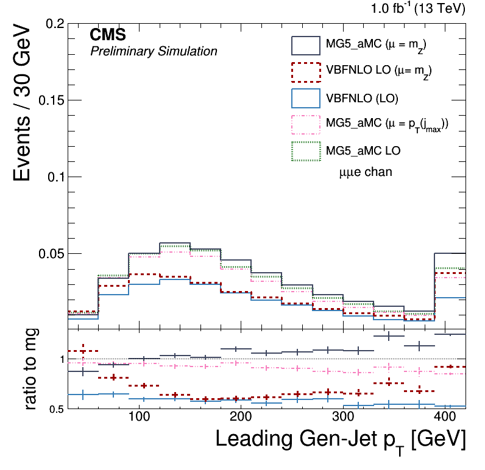 
        <a href="logs/j1Pt_event_info.log">[log]</a> - 
        <a href="logs/j1Pt_event_info-verbose.log">[verbose log]</a> - 
        <a href="plots/j1Pt.pdf">[pdf]</a>
    </td>
    <td style="text-align: center;">
        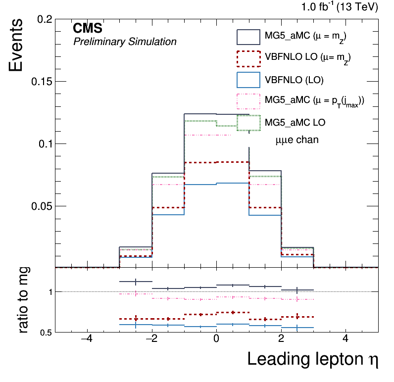 
        <a href="logs/l1Eta_event_info.log">[log]</a> - 
        <a href="logs/l1Eta_event_info-verbose.log">[verbose log]</a> - 
        <a href="plots/l1Eta.pdf">[pdf]</a>
    </td>
  </tr>
  <tr style="text-align: center;">
    <td style="text-align: center;">
        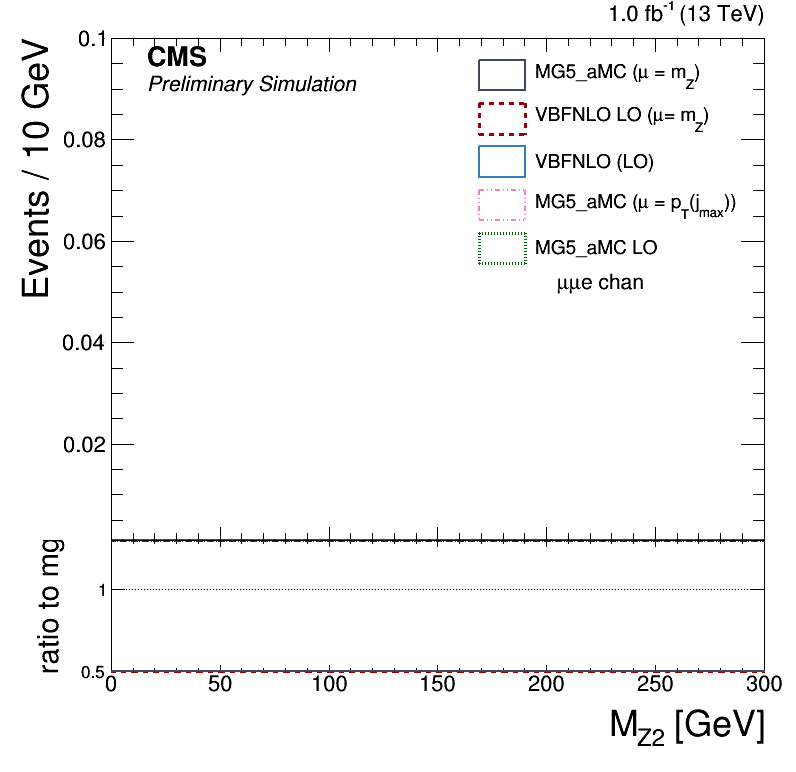 
        <a href="logs/Z2mass_event_info.log">[log]</a> - 
        <a href="logs/Z2mass_event_info-verbose.log">[verbose log]</a> - 
        <a href="plots/Z2mass.pdf">[pdf]</a>
    </td>
    <td style="text-align: center;">
        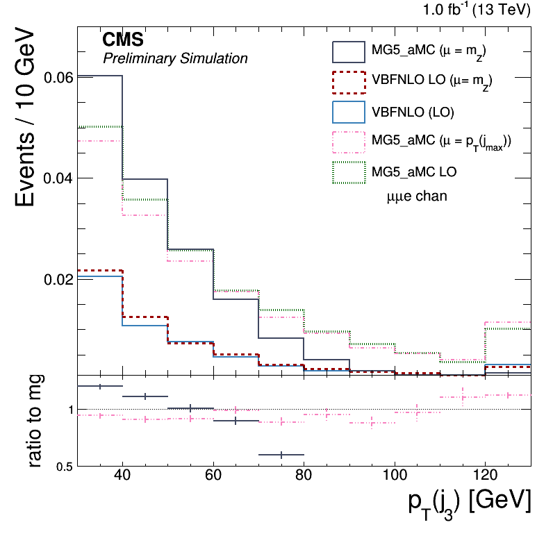 
        <a href="logs/j3Pt_event_info.log">[log]</a> - 
        <a href="logs/j3Pt_event_info-verbose.log">[verbose log]</a> - 
        <a href="plots/j3Pt.pdf">[pdf]</a>
    </td>
    <td style="text-align: center;">
        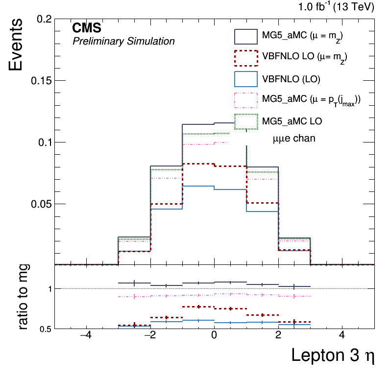 
        <a href="logs/l3Eta_event_info.log">[log]</a> - 
        <a href="logs/l3Eta_event_info-verbose.log">[verbose log]</a> - 
        <a href="plots/l3Eta.pdf">[pdf]</a>
    </td>
  </tr>
  <tr style="text-align: center;">
    <td style="text-align: center;">
        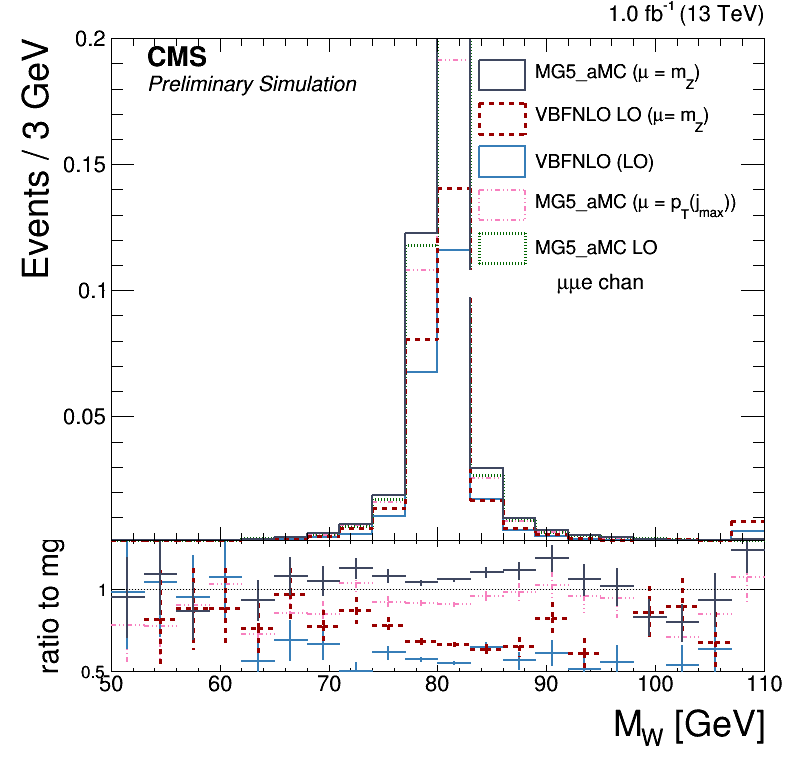 
        <a href="logs/W1mass_event_info.log">[log]</a> - 
        <a href="logs/W1mass_event_info-verbose.log">[verbose log]</a> - 
        <a href="plots/W1mass.pdf">[pdf]</a>
    </td>
    <td style="text-align: center;">
        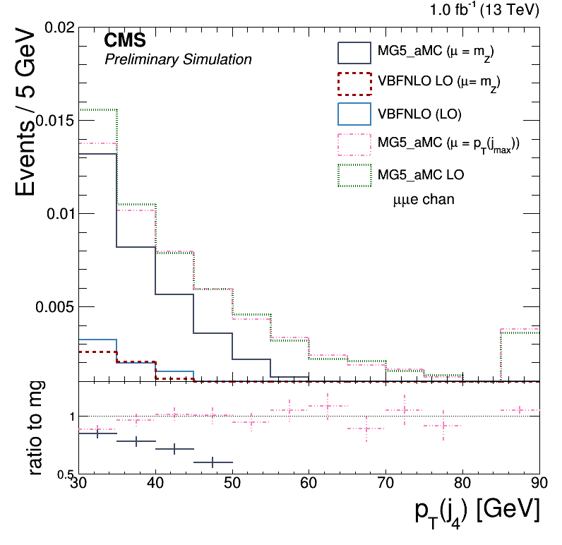 
        <a href="logs/j4Pt_event_info.log">[log]</a> - 
        <a href="logs/j4Pt_event_info-verbose.log">[verbose log]</a> - 
        <a href="plots/j4Pt.pdf">[pdf]</a>
    </td>
    <td style="text-align: center;">
         
        <a href="logs/nj_event_info.log">[log]</a> - 
        <a href="logs/nj_event_info-verbose.log">[verbose log]</a> - 
        <a href="plots/nj.pdf">[pdf]</a>
    </td>
  </tr>
  <tr style="text-align: center;">
    <td style="text-align: center;">
        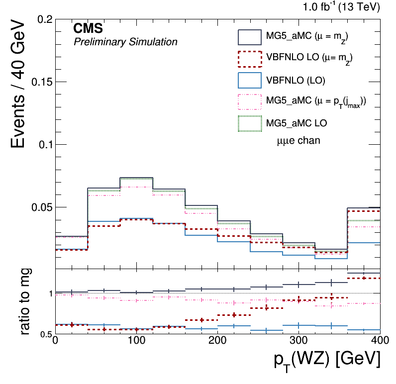 
        <a href="logs/Pt_event_info.log">[log]</a> - 
        <a href="logs/Pt_event_info-verbose.log">[verbose log]</a> - 
        <a href="plots/Pt.pdf">[pdf]</a>
    </td>
    <td style="text-align: center;">
        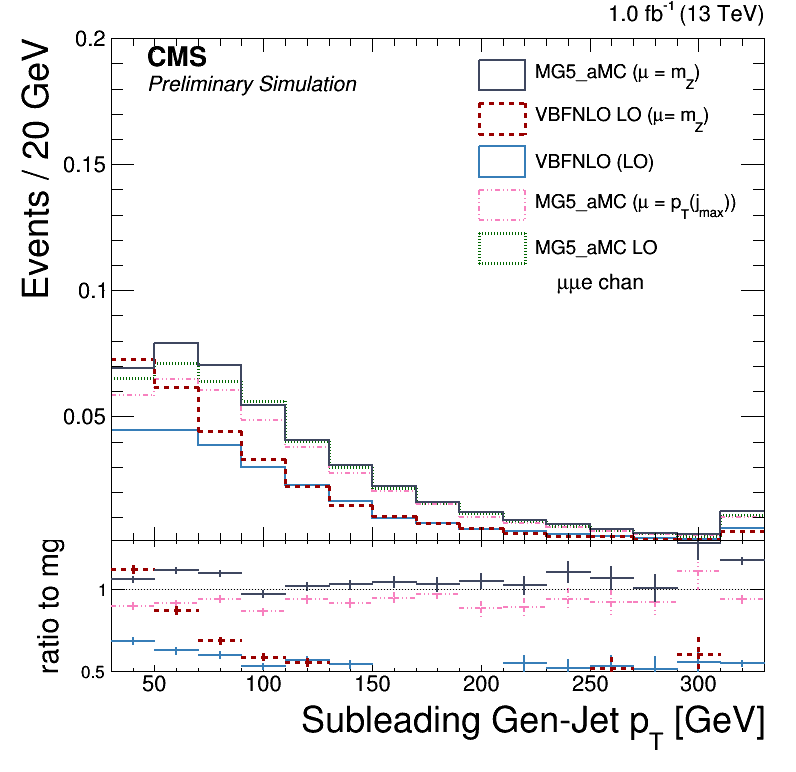 
        <a href="logs/j2Pt_event_info.log">[log]</a> - 
        <a href="logs/j2Pt_event_info-verbose.log">[verbose log]</a> - 
        <a href="plots/j2Pt.pdf">[pdf]</a>
    </td>
    <td style="text-align: center;">
        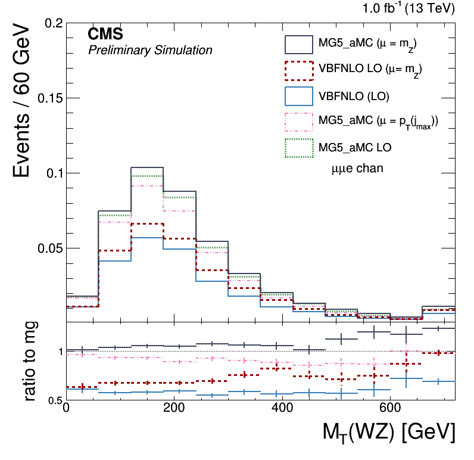 
        <a href="logs/MTtrue_event_info.log">[log]</a> - 
        <a href="logs/MTtrue_event_info-verbose.log">[verbose log]</a> - 
        <a href="plots/MTtrue.pdf">[pdf]</a>
    </td>
  </tr>
  <tr style="text-align: center;">
    <td style="text-align: center;">
        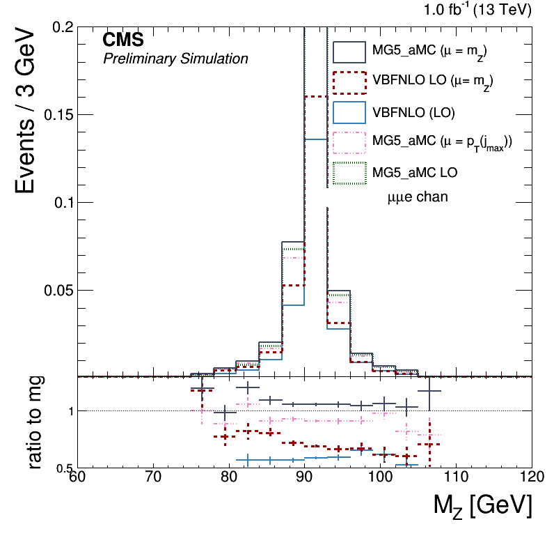 
        <a href="logs/Z1mass_event_info.log">[log]</a> - 
        <a href="logs/Z1mass_event_info-verbose.log">[verbose log]</a> - 
        <a href="plots/Z1mass.pdf">[pdf]</a>
    </td>
    <td style="text-align: center;">
         
        <a href="logs/Z1Pt_event_info.log">[log]</a> - 
        <a href="logs/Z1Pt_event_info-verbose.log">[verbose log]</a> - 
        <a href="plots/Z1Pt.pdf">[pdf]</a>
    </td>
    <td style="text-align: center;">
        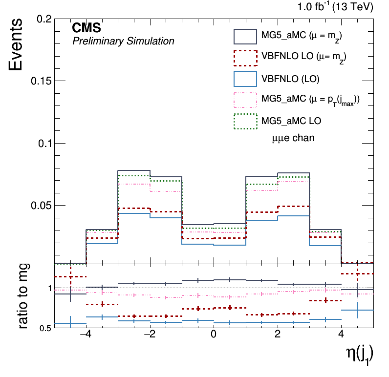 
        <a href="logs/j1Eta_event_info.log">[log]</a> - 
        <a href="logs/j1Eta_event_info-verbose.log">[verbose log]</a> - 
        <a href="plots/j1Eta.pdf">[pdf]</a>
    </td>
  </tr>
  <tr style="text-align: center;">
    <td style="text-align: center;">
        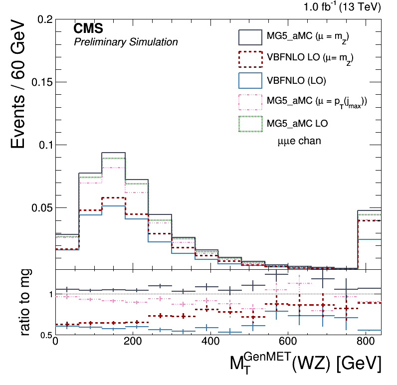 
        <a href="logs/MTgenMET_event_info.log">[log]</a> - 
        <a href="logs/MTgenMET_event_info-verbose.log">[verbose log]</a> - 
        <a href="plots/MTgenMET.pdf">[pdf]</a>
    </td>
    <td style="text-align: center;">
        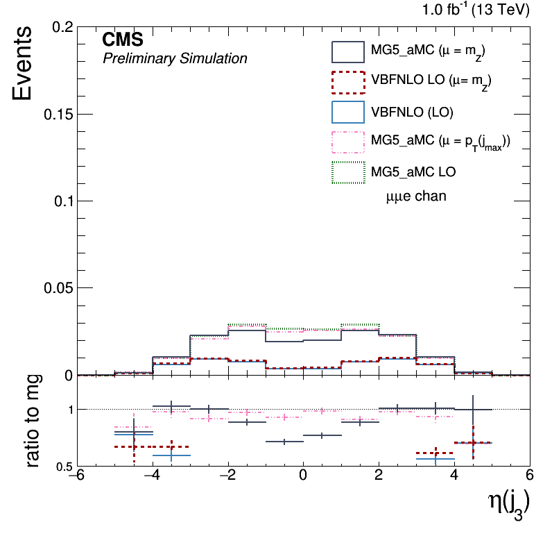 
        <a href="logs/j3Eta_event_info.log">[log]</a> - 
        <a href="logs/j3Eta_event_info-verbose.log">[verbose log]</a> - 
        <a href="plots/j3Eta.pdf">[pdf]</a>
    </td>
    <td style="text-align: center;">
        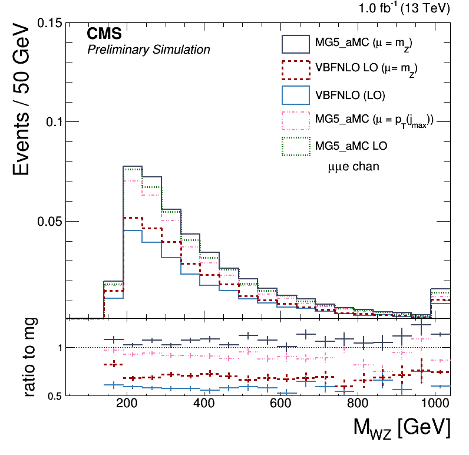 
        <a href="logs/Mass_event_info.log">[log]</a> - 
        <a href="logs/Mass_event_info-verbose.log">[verbose log]</a> - 
        <a href="plots/Mass.pdf">[pdf]</a>
    </td>
  </tr>
  <tr style="text-align: center;">
    <td style="text-align: center;">
        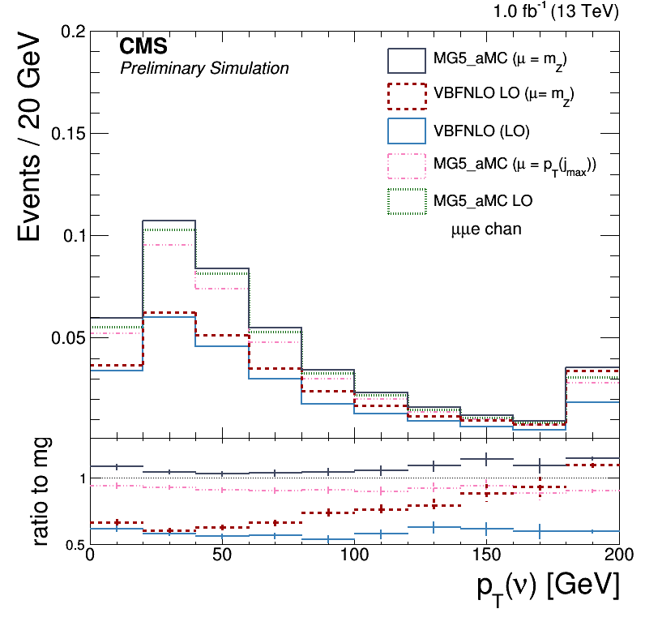 
        <a href="logs/NuPt_event_info.log">[log]</a> - 
        <a href="logs/NuPt_event_info-verbose.log">[verbose log]</a> - 
        <a href="plots/NuPt.pdf">[pdf]</a>
    </td>
    <td style="text-align: center;">
        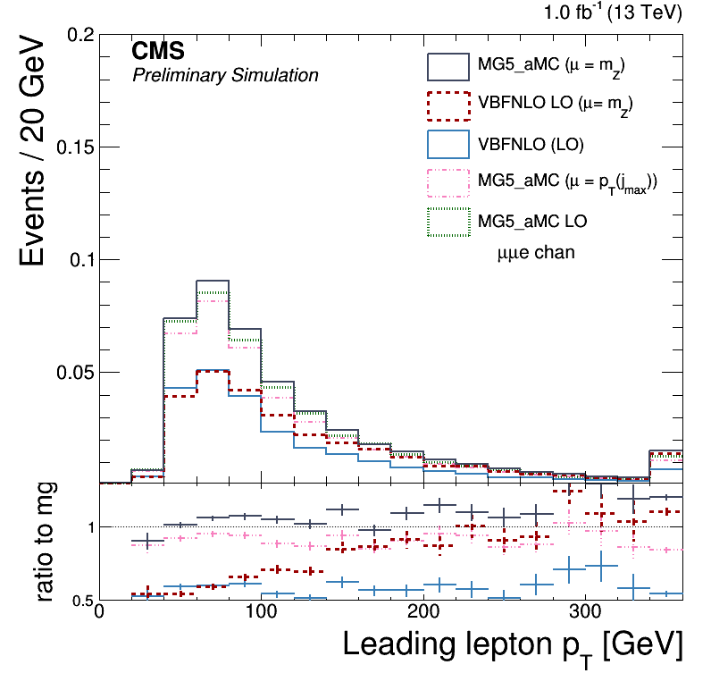 
        <a href="logs/l1Pt_event_info.log">[log]</a> - 
        <a href="logs/l1Pt_event_info-verbose.log">[verbose log]</a> - 
        <a href="plots/l1Pt.pdf">[pdf]</a>
    </td>
    <td style="text-align: center;">
        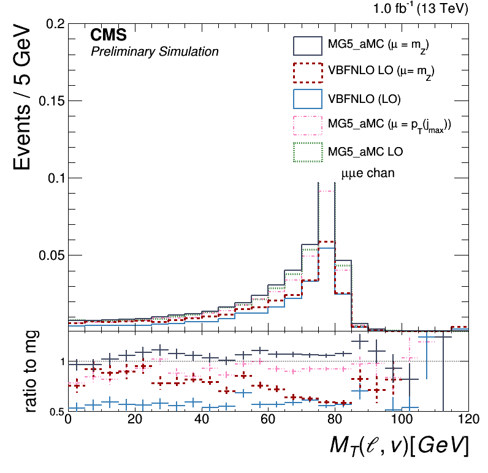 
        <a href="logs/W1MTtrue_event_info.log">[log]</a> - 
        <a href="logs/W1MTtrue_event_info-verbose.log">[verbose log]</a> - 
        <a href="plots/W1MTtrue.pdf">[pdf]</a>
    </td>
  </tr>
  <tr style="text-align: center;">
    <td style="text-align: center;">
        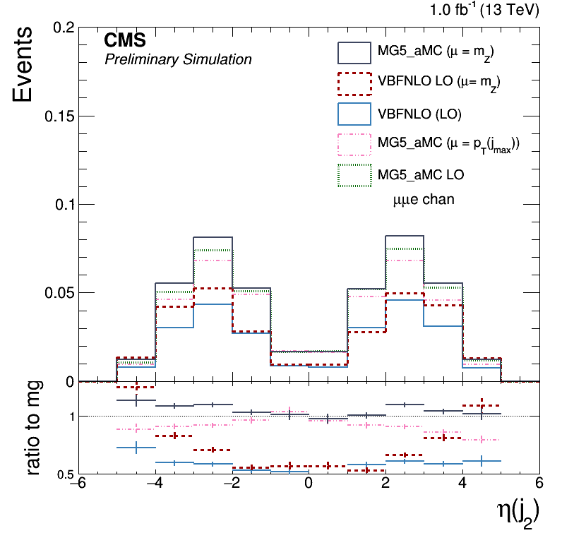 
        <a href="logs/j2Eta_event_info.log">[log]</a> - 
        <a href="logs/j2Eta_event_info-verbose.log">[verbose log]</a> - 
        <a href="plots/j2Eta.pdf">[pdf]</a>
    </td>
    <td style="text-align: center;">
        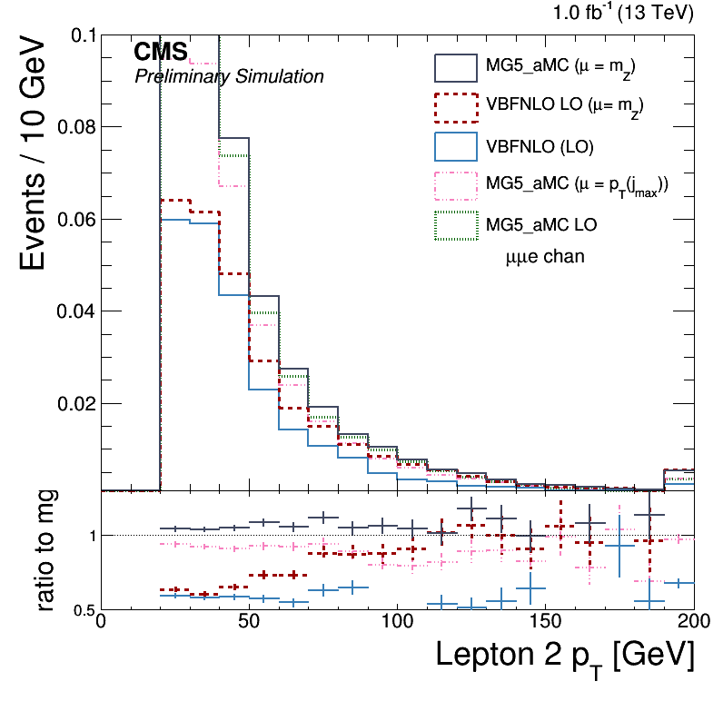 
        <a href="logs/l2Pt_event_info.log">[log]</a> - 
        <a href="logs/l2Pt_event_info-verbose.log">[verbose log]</a> - 
        <a href="plots/l2Pt.pdf">[pdf]</a>
    </td>
    <td style="text-align: center;">
        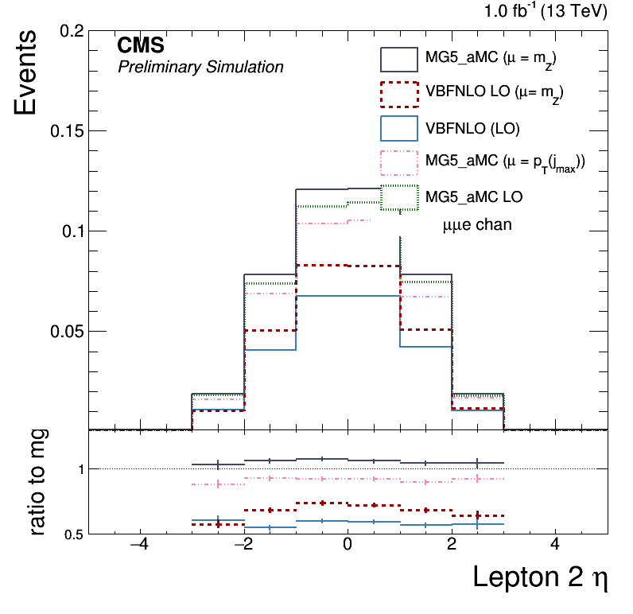 
        <a href="logs/l2Eta_event_info.log">[log]</a> - 
        <a href="logs/l2Eta_event_info-verbose.log">[verbose log]</a> - 
        <a href="plots/l2Eta.pdf">[pdf]</a>
    </td>
  </tr>
  <tr style="text-align: center;">
    <td style="text-align: center;">
        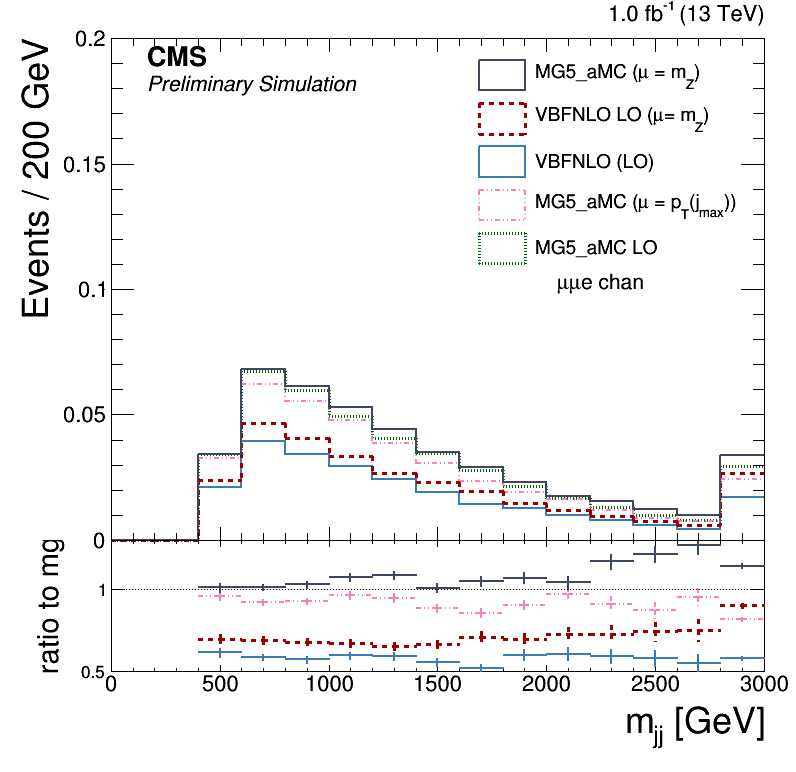 
        <a href="logs/mjj_event_info.log">[log]</a> - 
        <a href="logs/mjj_event_info-verbose.log">[verbose log]</a> - 
        <a href="plots/mjj.pdf">[pdf]</a>
    </td>
    <td style="text-align: center;">
        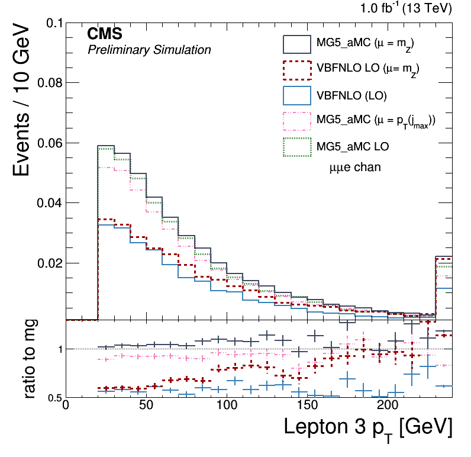 
        <a href="logs/l3Pt_event_info.log">[log]</a> - 
        <a href="logs/l3Pt_event_info-verbose.log">[verbose log]</a> - 
        <a href="plots/l3Pt.pdf">[pdf]</a>
    </td>
    <td style="text-align: center;">
        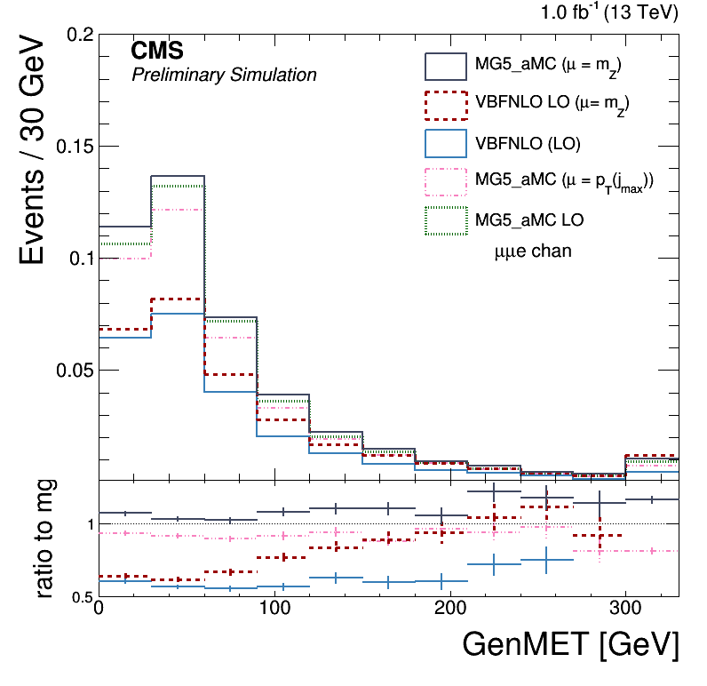 
        <a href="logs/MET_event_info.log">[log]</a> - 
        <a href="logs/MET_event_info-verbose.log">[verbose log]</a> - 
        <a href="plots/MET.pdf">[pdf]</a>
    </td>
  </tr>
  <tr style="text-align: center;">
    <td style="text-align: center;">
        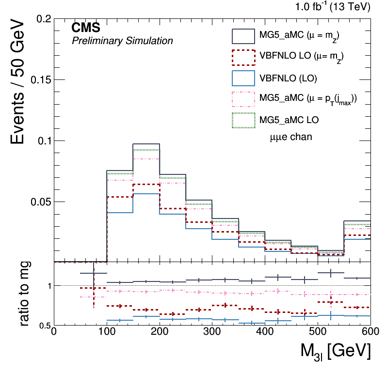 
        <a href="logs/3lmass_event_info.log">[log]</a> - 
        <a href="logs/3lmass_event_info-verbose.log">[verbose log]</a> - 
        <a href="plots/3lmass.pdf">[pdf]</a>
    </td>
</body>
</html>
